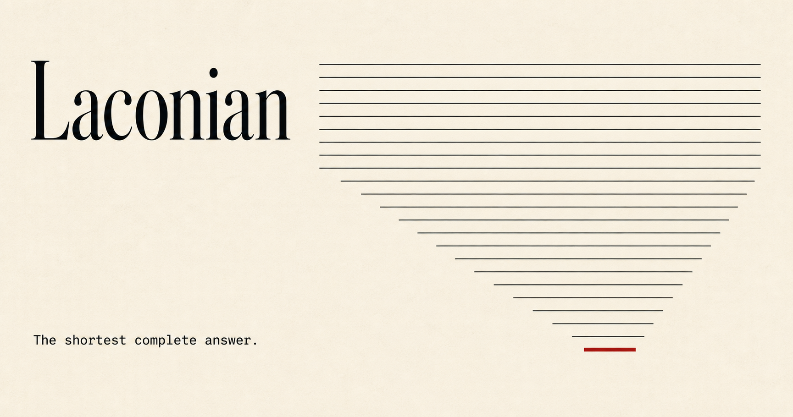

> **Experimental reconstruction.** This edition is a modern experiment in fragmentarily attested
> Laconian Doric; it is not an authentic ancient text. Identifiers and many unattested software
> terms remain in English and are code-formatted. Expert review and corrections are invited.
>
> **Πειραματικὴ νεωτέρα ἀνάπλασις.** Ἁ παλαιὰ Λακωνικὰ διάλεκτος κατὰ μέρος μόνον
> μαρτυρεῖται· τόδε νεώτερον κείμενον οὐ γνήσιον ἀρχαῖον ἐστί. Τὰ νεώτερα τεχνικὰ
> ὀνόματα Ἀγγλιστὶ καὶ ἐν σημείοις γράφεται· τοὺς δὲ εἰδήμονας ἐπισκοπεῖν καὶ
> διορθοῦν παρακαλέομες.

**Σημείωσις ἐκδοτικά.** Ἁ ἀνάπλασις συντηρητικῶς χρῆται ἐπιλελεγμένοις Δωρικοῖς καὶ
δυτικοῖς Ἑλληνικοῖς τύποις—τῷ μακρῷ α, τῷ μορίῳ κα, καὶ τῇ παρὰ Πλουτάρχῳ
μαρτυρουμένᾳ λέξει `αἴκα`. Οὐχ ὑπολαμβάνει ὡς ἕκαστος τύπος τοῦδε τοῦ νεωτέρου
κειμένου ἐν παλαιᾷ Λακωνικᾷ μαρτυρεῖται, οὐδὲ τὰς ἀμφισβητουμένας ἢ ὀψιτέρας
φωνητικὰς γραφὰς πανταχοῦ μιμεῖται. Τὰ ἀμαρτήματα καὶ αἱ διορθώσεις παρὰ τῶν
εἰδημόνων ἀσμένως δεχόμεθα.

[Website](https://agent-axiom.github.io/laconian/) · [English](../../README.md) · [Русский](README.ru.md) · [简体中文](README.zh-CN.md) · [Ελληνικά](README.el.md) · [Italiano](README.it.md) · [Laconian Doric (reconstructed)](README.grc-x-laconian.md)

# Laconian

Τὸ Laconian τὰν βραχυτάταν τελείαν ἀπόκρισιν αἰτεῖ—οὐ τὰν βραχυτάταν μόνον.

Τὸ Laconian δημόσιον φιλοσοφικὸν ἔργον ἐστίν, ἓν φορητὸν `Markdown skill`
καὶ ἀνεῳγμένον `benchmark` ἔχον, ὃ δοκιμάζει πότερον ἁ βραχύτας τὰν τελείαν
ἀπόκρισιν σώζει.

Τὸ [`skills/if/SKILL.md`](../../skills/if/SKILL.md) ὅλον τὸ `installable artifact` ἐστίν.

## Κατάστασις

Τὸ Laconian `pre-release` ἐστὶ καὶ ἔτι ποιεῖται. Ἔχει ὁδὸν `evaluation`
πιστευτηρίων μὴ δεομέναν καὶ προαιρετικὸν ζῶντα `provider adapter`.

Οὐδὲν δημόσιον ἀποτέλεσμα τοῦ `benchmark` ἔτι ἔστιν. Τὰ `smoke` καὶ
`replay fixtures` τὰν ὁδὸν τοῦ `evaluation` δοκιμάζει· οὐ δημόσια τεκμήρια τοῦ
`performance` ἐστίν, οὐδὲ δηλοῖ ὅτι τὸ `if` νικᾷ, δαπάναν σῴζει, ἢ ἄλλου
συγκριτικοῦ `arm` βέλτιον ἔργον ποιεῖ.

## Ἄρξαι ἐνθένδε

- [Ἀνάγνωθι τὸ `skill`](../../skills/if/SKILL.md)
- [Ἐγκατάστησον καὶ χρῆσαι αὐτῷ](../using-the-skill.md)
- [Τὸ `benchmark` τέλεσον](../../benchmarks/README.md)

## `Documentation`

Τὸ λεπτομερὲς `documentation` Ἀγγλιστὶ μόνον νῦν γέγραπται:

- [Πίναξ τοῦ `documentation`](../README.md)
- [Φιλοσοφία](../philosophy.md)
- [`Design`](../design.md)
- [Δεδομένα τοῦ `evaluation`](../../evals/README.md)
- [Μέθοδος τοῦ `benchmark`](../../benchmarks/methodology.md)

## Συνεισφορά καὶ ἀσφάλεια

Ἄρξαι ἀπὸ τοῦ [CONTRIBUTING.md](../../CONTRIBUTING.md), εἰ συνεισφέρειν βούλει.
Τὰ περὶ ἀσφαλείας ἀγγέλματα κατὰ τὸ [SECURITY.md](../../SECURITY.md), οὐκ ἐν
δημοσίῳ `issue`, πέμπεται.

## Ἄδεια

Τὸ ἀποθετήριον μικτὸν πίνακα ἀδειῶν ἔχει. Ὅρα τὸ [NOTICE](../../NOTICE), ὅ
ἐστι κύριος πίναξ τῶν ὁδῶν καὶ ἀδειῶν.
